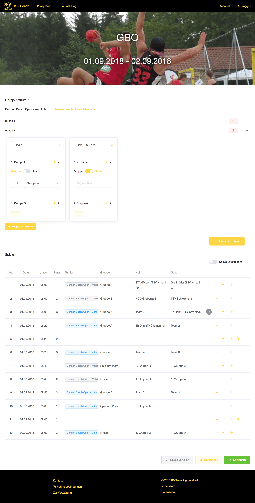
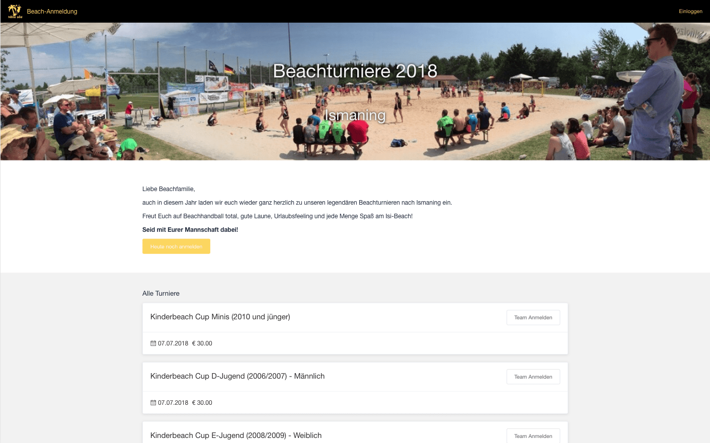
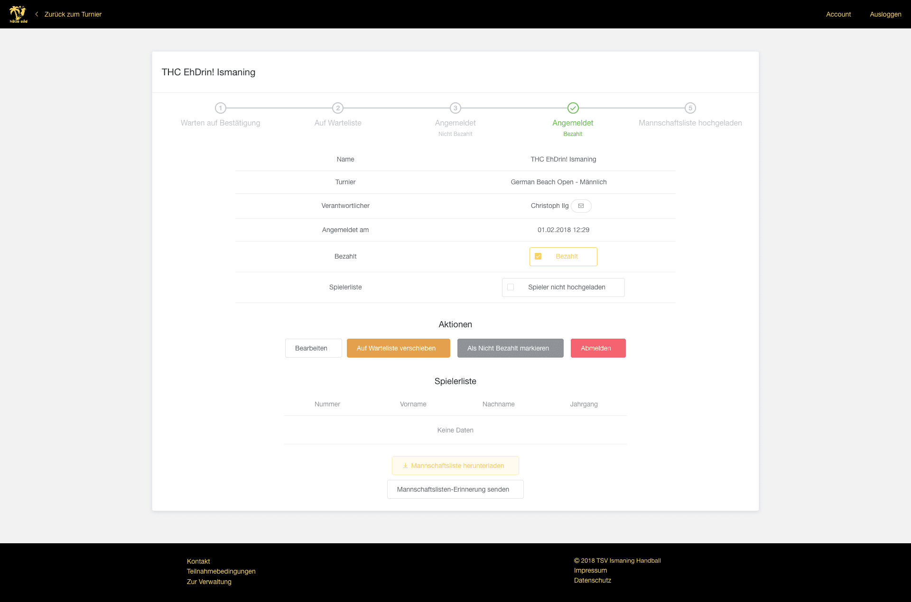

import CallToAction from '../../components/CallToAction.astro'
import Icon from '../../components/Icon.astro'

## beach

For my local Handball club I created a system, over which the registrations for the big summer tournaments can be handled easily. Also the Game Schedule can be administered. For the backend the Python framework Django was used, which delivers the data via a REST-API to the frontend, which runs on Vue.js. This App is a rewrite/consolidation of the old Beachanmeldung and SpielplanIsmaning apps.

 

