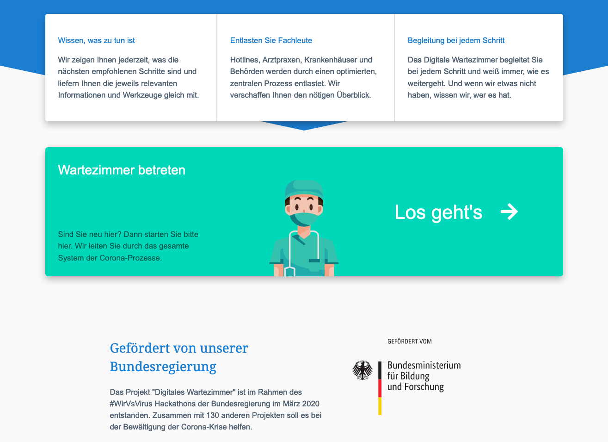
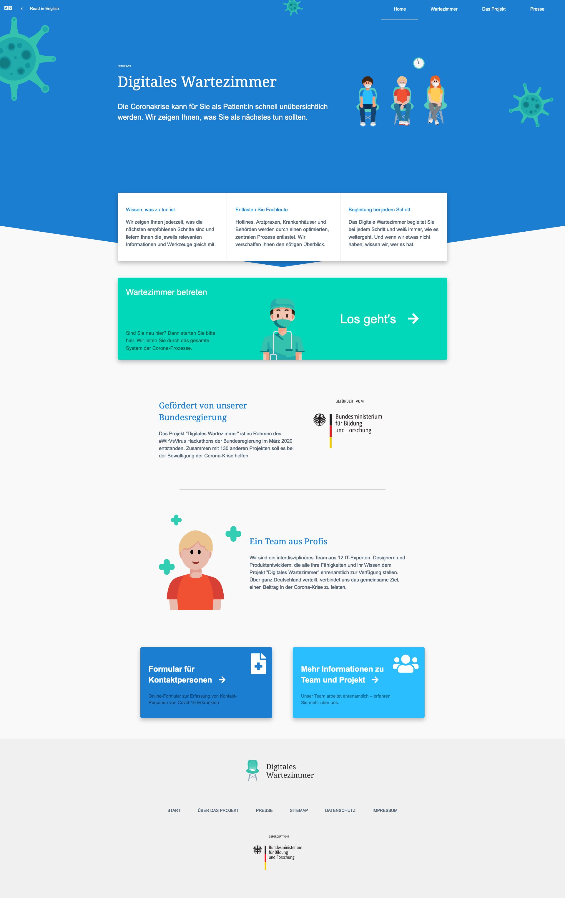

import CallToAction from '../../components/CallToAction.astro'
import Icon from '../../components/Icon.astro'

## Digitales Wartezimmer

Simple and efficient exchange of information between health authorities and citizens for rapid containment of infectious diseases

With our digital solution, all relevant information of COVID-19 contact persons will be digitally captured and transferred to the systems used by the responsible health authorities to track contact persons. By digitizing the transmission of COVID-19 contact person data, we want to help health authorities break the chain of infection quickly. At the same time, the COVID-19 contact person solution should provide a fast and user-friendly way to contact his/her health authority. In further steps, this information transfer will be extended by further digital solutions, so that a reciprocal digital communication between health authorities and citizens is enabled.

 

<CallToAction href="https://digitales-wartezimmer.org">Visit Site<Icon icon="open" size="1.2em" viewBoxSize={512} colorizeFill/></CallToAction>

<CallToAction href="https://gitlab.com/digitales-wartezimmer">Visit GitHub Repo<Icon icon="github-logo" size="1.2em" viewBoxSize={512} colorizeFill/></CallToAction>

 
Funded by the federal ministry of education and research of Germany
