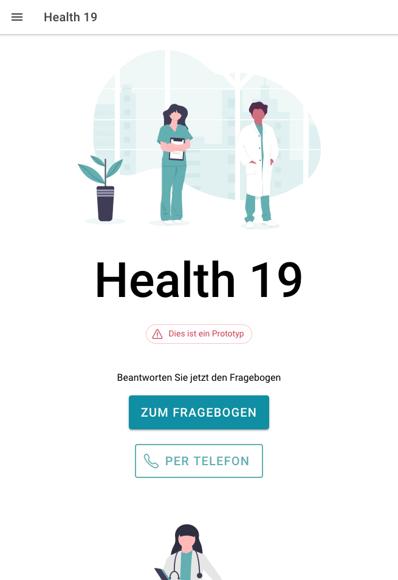
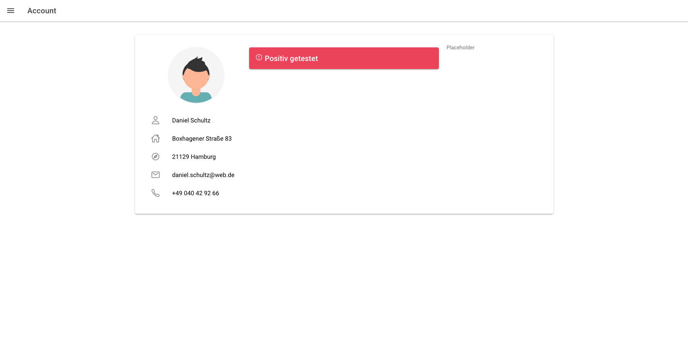

import CallToAction from '../../components/CallToAction.astro'
import Icon from '../../components/Icon.astro'

## Health 19

Digitalization of Covid-19 Test processes

In the context of the WirVsVirus - Hackathon of the federal government of Germany me and my team created the Health19 Web Application with Angular to facilitate the test precesses for Covid - 19. This project was voted to be under the Top 130 Projects.

 

<CallToAction href="https://github.com/WirVsVirusCovidTestProcess/PatientApp">Visit GitHub Repo<Icon icon="github-logo" size="1.2em" viewBoxSize={512} colorizeFill/></CallToAction>

 
This Project is a Prototype and not intended for production use