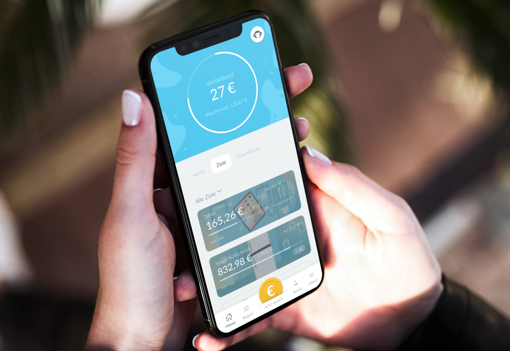

import CallToAction from '../../components/CallToAction.astro'
import Icon from '../../components/Icon.astro'

## Monkee 

Monkee is an app designed to make saving money simple and rewarding. It lets you set personal savings goals, automate contributions, and use smart saving rules to reach them faster. With Monkee, you can also earn cashback on everyday purchases, making your money work harder while you spend. The app provides an intuitive overview of all your goals, helps you track progress, and motivates you with tips and challenges—turning saving into a fun and effortless habit.

 

<CallToAction href="https://monkee.rocks">Visit Site<Icon icon="open" size="1.2em" viewBoxSize={512} colorizeFill/></CallToAction>